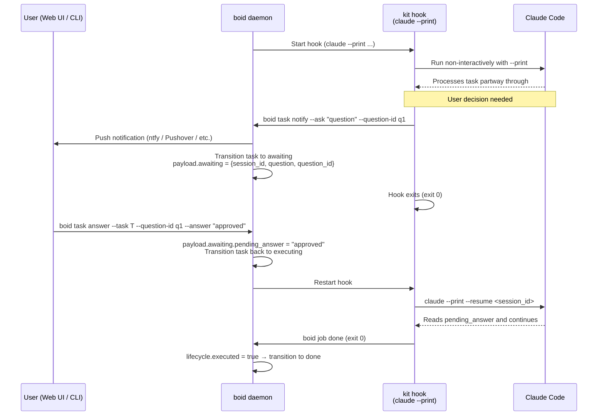

# C2 Flow: Q&A Channel

> **Updated 2026-05-14:** Claude Code's upcoming pricing change moves `claude --print` (non-interactive) to a separate metered credit pool, so hook-launched agent sessions now run on a **real PTY in interactive mode** again. The `--resume <session_id>` continuation contract and the state-machine Q&A channel survive unchanged; what changed is that session termination is driven by daemon-side SIGTERM (on a successful `notify --ask` or `boid job done` from the agent) rather than the agent emitting a "paused" sentinel. References to `claude --print` below describe the historical design.

C2 (Command and Control) is the design that decouples boid's agent execution model from direct PTY interaction and routes user interaction through a **state-machine Q&A channel**.

## Motivation

The traditional interactive mode connected Claude to a PTY in a tmux session. That model had three problems:

- **Mobile UX**: Rendering PTY sessions in a browser via xterm.js causes keyboard issues on mobile that are difficult to control.
- **Multi-agent scaling**: Managing a separate tmux + PTY per concurrent task adds operational complexity.
- **Session-drop risk**: If the tmux session dies while waiting for user input, the agent stalls.

C2 solves all three by standardising every agent run on a **one-shot `claude --print` invocation** and routing user interaction through a **state-machine Q&A channel**.

## State machine

```
                    +--------+   abort / job_failed
                    |aborted |<--------------------+
                    +--------+                     |
                                                   |
   start                                           |
pending -----> executing -----> done               |
                  ^    ^                           |
                  |    | ask                       |
                  |    +-------+                   |
                  |            v                   |
                  |        awaiting                |
                  |            |                   |
                  +-- answer --+                   |
                                                   |
```

| State | Meaning |
|---|---|
| `pending` | Created, not yet started |
| `executing` | Hooks are doing the main work |
| `awaiting` | Agent is waiting for a user reply |
| `done` | Terminal success |
| `aborted` | Terminal failure (manual abort or job failure) |

### New transitions

| Action | From | To | Notes |
|---|---|---|---|
| `ask` | `executing` | `awaiting` | Issued by `boid task notify --ask`. Called from inside the hook script. |
| `answer` | `awaiting` | `executing` | Issued by `boid task answer` or the Web UI. Triggers a hook restart. |

All other transition rules are documented in [State machine](../guide/state-machine.md).

## Lifecycle diagram (mermaid)



## claude --print + session_id + resume

### Why `--print`

`claude --print` is a **batch mode** that writes output to stdout and exits. No PTY attachment is needed, which means:

- The process is a straightforward child of the boid daemon.
- Output is fully captured and readable via `boid job show <id>`.
- The Web UI does not need to attach to a running session.

### session_id and --resume

`claude --print` assigns a session ID to each run. Passing `--resume <session_id>` to a subsequent invocation continues from the same context.

In C2, the hook script follows this sequence:

1. Run `claude --print ...`, capture the session ID, and write it to `payload.awaiting.session_id`.
2. The agent calls `boid task notify --ask "question"`.
3. The hook exits cleanly (exit 0).
4. When the user answers, the task returns to `executing` and the hook is restarted.
5. The hook reads `payload.awaiting.session_id` and calls `claude --print --resume <session_id>`.
6. Claude reads `payload.awaiting.pending_answer` and continues processing.
7. The kit clears `pending_answer` to mark it as consumed.

### payload.awaiting structure

```json
{
  "awaiting": {
    "session_id":     "sess_xxx",
    "question":       "Should I merge PR #42?",
    "question_id":    "q-uuid-here",
    "pending_answer": "yes"
  }
}
```

| Field | Written by | Content |
|---|---|---|
| `session_id` | kit (hook script) | ID to pass to `claude --print --resume` |
| `question` | boid (set by `notify --ask`) | Question text displayed to the user |
| `question_id` | boid (generated by `notify --ask`) | UUID that identifies this Q&A turn |
| `pending_answer` | boid (set by `task answer`) | User's reply. Cleared by the kit after consuming. |

## notify --ask + answer flow

### Kit side (hook script)

```bash
# 1. Launch Claude and save the session ID
SESSION_ID=$(claude --print --print-session-id ... 2>/dev/null)
boid task update "${BOID_TASK_ID}" --patch-file <(
  jq -n --arg sid "$SESSION_ID" '{"awaiting": {"session_id": $sid}}'
)

# 2. Notify the user with a question (Q&A mode → transitions to awaiting)
boid task notify "${BOID_TASK_ID}" \
  --message "Decision needed: should I merge the PR?" \
  --ask "Should I merge PR #42?"

# 3. Hook exits normally — boid transitions the task to awaiting
exit 0
```

### User side (answering)

Answer from the task detail page in the Web UI, or from the CLI directly:

```bash
boid task answer \
  --task <task-id> \
  --question-id <question-id> \
  --answer "yes"
```

When the answer arrives, the task transitions `awaiting → executing` and the hook is restarted.

### Kit side (resumed hook)

```bash
# 1. Read values from the awaiting payload
SESSION_ID=$(boid task get "${BOID_TASK_ID}" --field payload | jq -r '.awaiting.session_id // ""')
ANSWER=$(boid task get "${BOID_TASK_ID}" --field payload | jq -r '.awaiting.pending_answer // ""')

if [ -n "$ANSWER" ]; then
  # 2. Consume (clear) pending_answer
  boid task update "${BOID_TASK_ID}" --patch-file <(
    jq -n '{"awaiting": {"pending_answer": ""}}'
  )

  # 3. Resume the session and continue
  claude --print --resume "$SESSION_ID" \
    --system-prompt "User answer: ${ANSWER}" \
    ...
fi
```

## Migration notes from PTY-based kits

| Aspect | Old interactive mode | New C2 mode |
|---|---|---|
| Hook kind | `kind: agent` (interactive=true) | `kind: agent` (interactive=false) |
| How Claude starts | `claude` (PTY session) | `claude --print` (non-interactive) |
| User interaction | Direct attach to tmux session | notify --ask → Q&A channel |
| Session management | tmux + PTY | session_id + --resume |
| Viewing output in Web UI | xterm.js viewer | Job log (SSE) |
| Mobile operation | Difficult | Possible via answer form |

### If you still use interactive sessions during the transition

During the migration period, interactive and C2 mode tasks may coexist. Keep these points in mind:

- **tmux session can drop while awaiting**: If a task that is still using interactive mode enters `awaiting`, a dropped tmux session will leave the agent unable to respond. Recover with `boid task hook replay`.
- **session_id expiry**: The session ID used for `--resume` does not last forever. If `awaiting` persists for a long time, resume may fail. Timeout handling is left to the kit implementation.
- **Answering an interactive=true task**: The state transition works, but if `claude` requires a PTY, it will fail on restart. Migrate to C2 mode instead.

## Related documentation

- [State machine](../guide/state-machine.md) — All states and transition rules
- [Notifications](../guide/notifications.md) — Configuring notify.command
- [CLI reference](../reference/cli.md#tasks) — `boid task notify` / `boid task answer`
- [HTTP API reference](../reference/http-api.md#notify-and-answer-c2) — `POST /tasks/{id}/notify` / `POST /tasks/{id}/answer`
