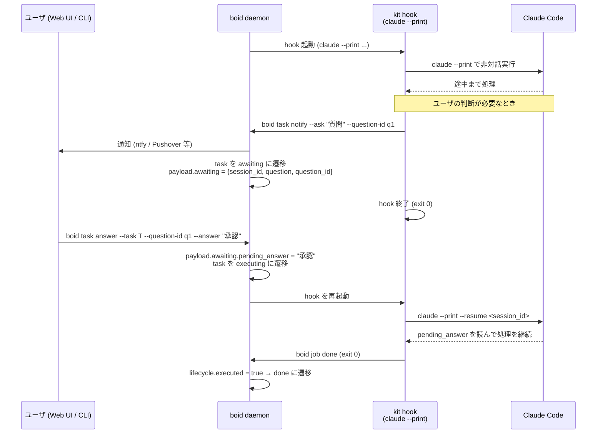

# C2 フロー：Q&A 運用

> **2026-05-14 更新:** Claude Code の料金プラン変更で `claude --print` (非対話) が別枠クレジット消費となるため、 hook 経由のエージェントセッションは **再び PTY 上で interactive に起動** されるようになりました。 ただし `--resume <session_id>` による状態継承と Q&A チャンネル (state machine 経由のユーザ回答配送) は引き続き利用されており、 終了は agent 内の "paused" sentinel ではなく daemon 側 SIGTERM (`notify --ask` 成功時または `boid job done` 受領時) で行います。 本ドキュメント内の `claude --print` 記述は historic な設計意図として参照してください。

C2 (Command and Control) は、 boid のエージェント実行モデルから PTY 直接対話への依存を取り払い、ユーザとのやり取りを **状態機械を介した Q&A チャンネル** に乗せる設計です。

## 動機

従来の interactive モードでは、 claude が tmux セッション上の PTY に接続して動いていました。このモデルには次の問題がありました。

- **モバイル UX の問題**: Web UI から PTY セッションを xterm.js で表示すると、スマホブラウザの keyboard 挙動が制御しきれず操作性が低い
- **マルチエージェント対応の限界**: 複数の並行タスクでそれぞれ tmux + PTY を管理する複雑性が増大する
- **セッション切れのリスク**: Q&A 待ち中に tmux セッションが切れると agent が詰まる

C2 はこれらを解消するため、すべてのエージェント実行を **一方向の `claude --print` 起動** に統一し、ユーザとのやり取りには **状態機械を介した Q&A チャンネル** を使います。

## 状態マシン

```
                    +--------+   abort / job_failed
                    |aborted |<--------------------+
                    +--------+                     |
                                                   |
   start                                           |
pending -----> executing -----> done               |
                  ^    ^                           |
                  |    | ask                       |
                  |    +-------+                   |
                  |            v                   |
                  |        awaiting                |
                  |            |                   |
                  +-- answer --+                   |
                                                   |
```

| 状態 | 意味 |
|---|---|
| `pending` | 作成済み、未開始 |
| `executing` | hook が主作業中 |
| `awaiting` | エージェントがユーザの回答を待機中 |
| `done` | 成功で終端 |
| `aborted` | 失敗で終端 (手動 abort、 job 失敗) |

### 手動遷移の追加分

| Action | From | To | 備考 |
|---|---|---|---|
| `ask` | `executing` | `awaiting` | `boid task notify --ask` が発行。 hook スクリプト内から呼ぶ |
| `answer` | `awaiting` | `executing` | `boid task answer` または Web UI が発行。 ユーザが回答を送ると hook が再起動 |

`ask` と `answer` 以外の遷移ルールは [状態機械](../guide/state-machine.md) を参照してください。

## ライフサイクル図 (mermaid)



## claude --print + session_id + resume の機構

### なぜ `--print` か

`claude --print` は stdout に出力して終了する **バッチモード** です。 PTY への attach が不要なため:

- boid daemon の子プロセスとして素直に管理できる
- スタンドアロンの `boid job show <id>` で出力全体を確認できる
- Web UI からセッションを attach せずに済む

### session_id と --resume

`claude --print` は実行セッションに対して session ID を発行します。これを `--resume <session_id>` に渡すと、前回セッションのコンテキストを引き継いで実行を継続できます。

C2 では、hook スクリプトが次の順序を踏みます。

1. `claude --print ...` を実行し、 session ID を取得して `payload.awaiting.session_id` に書き込む
2. エージェントが `boid task notify --ask "質問"` を呼ぶ
3. hook は正常終了 (exit 0) する
4. ユーザが回答を送ると task が `executing` に戻り、 hook が再起動される
5. hook は `payload.awaiting.session_id` を読んで `claude --print --resume <session_id>` を実行する
6. Claude が `payload.awaiting.pending_answer` を読んで処理を継続する
7. kit が `ClearPendingAnswer` 相当の処理でペンディング回答を消費済みにマークする

### payload.awaiting の構造

```json
{
  "awaiting": {
    "session_id":     "sess_xxx",
    "question":       "PR #42 をマージしてよいですか？",
    "question_id":    "q-uuid-here",
    "pending_answer": "yes"
  }
}
```

| フィールド | 書き込み主体 | 内容 |
|---|---|---|
| `session_id` | kit (hook スクリプト) | `claude --print --resume` に渡す ID |
| `question` | boid (`notify --ask` で設定) | ユーザに表示する質問文 |
| `question_id` | boid (`notify --ask` で生成) | Q&A ターンを識別する UUID |
| `pending_answer` | boid (`task answer` で設定) | ユーザの回答。 hook が消費したらクリア |

## notify --ask + answer の流れ

### kit 側 (hook スクリプト)

```bash
# 1. claude を起動して session_id を取得・保存
SESSION_ID=$(claude --print --print-session-id ... 2>/dev/null)
boid task update "${BOID_TASK_ID}" --patch-file <(
  jq -n --arg sid "$SESSION_ID" '{"awaiting": {"session_id": $sid}}'
)

# 2. 質問をユーザに通知 (Q&A モードで awaiting に遷移)
boid task notify "${BOID_TASK_ID}" \
  --message "判断が必要です: PR をマージしてよいですか？" \
  --ask "PR #42 をマージしてよいですか？"

# 3. hook は正常終了 — boid が状態を awaiting に遷移させる
exit 0
```

### ユーザ側 (回答)

Web UI のタスク詳細から回答するか、 CLI から直接送ります。

```bash
boid task answer \
  --task <task-id> \
  --question-id <question-id> \
  --answer "yes"
```

回答が届くと task は `awaiting → executing` に遷移し、 hook が再起動されます。

### kit 側 (再起動後の hook スクリプト)

```bash
# 1. awaiting payload から値を取得
SESSION_ID=$(boid task get "${BOID_TASK_ID}" --field payload | jq -r '.awaiting.session_id // ""')
ANSWER=$(boid task get "${BOID_TASK_ID}" --field payload | jq -r '.awaiting.pending_answer // ""')

if [ -n "$ANSWER" ]; then
  # 2. pending_answer を消費 (クリア)
  boid task update "${BOID_TASK_ID}" --patch-file <(
    jq -n '{"awaiting": {"pending_answer": ""}}'
  )

  # 3. セッションを resume して処理を継続
  claude --print --resume "$SESSION_ID" \
    --system-prompt "ユーザの回答: ${ANSWER}" \
    ...
fi
```

## 既存 PTY ベース kit からの移行ノート

| 観点 | 旧 interactive モード | 新 C2 モード |
|---|---|---|
| hook の種別 | `kind: agent` (interactive=true) | `kind: agent` (interactive=false) |
| Claude 起動方法 | `claude` (PTY セッション) | `claude --print` (非対話) |
| ユーザとのやり取り | tmux セッションに直接 attach | notify --ask → Q&A チャンネル |
| セッション管理 | tmux + PTY | session_id + --resume |
| Web UI での閲覧 | xterm.js ビューア | job log (SSE) |
| モバイル操作 | 困難 | 回答フォームで可能 |

### 過渡期に interactive session を使う場合の注意

移行が完了するまでの期間は、旧 interactive モードと C2 モードが混在することがあります。その際の注意点:

- **Q&A 中に tmux セッションが切れる可能性**: interactive モードのタスクが `awaiting` になった場合、 tmux セッションが切れると agent が応答できなくなる。その場合は `boid task hook replay` で hook を再起動する
- **session_id の有効期限**: `--resume` に使う session_id は無期限ではない。長期間 awaiting が続くと resume できなくなる場合がある。タイムアウト方針は kit の実装に依存する
- **interactive=true のタスクへの answer**: 技術的には遷移は可能だが、 `claude` が PTY を必要とする場合は再起動後に失敗する。 C2 モードへの移行を推奨

## 関連ドキュメント

- [状態機械](../guide/state-machine.md) — 全状態・遷移ルール
- [通知](../guide/notifications.md) — notify.command の設定
- [CLI リファレンス](../reference/cli.md#タスク) — `boid task notify` / `boid task answer`
- [HTTP API リファレンス](../reference/http-api.md#通知と回答-c2) — `POST /tasks/{id}/notify` / `POST /tasks/{id}/answer`
